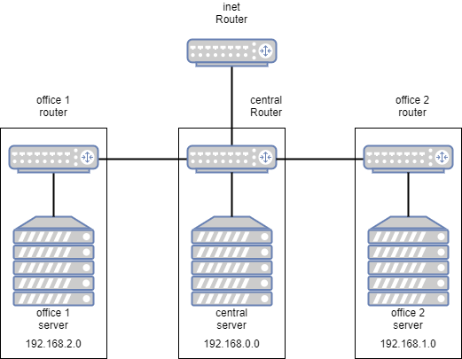
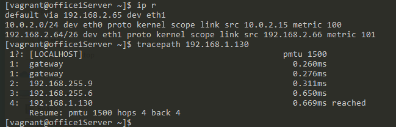
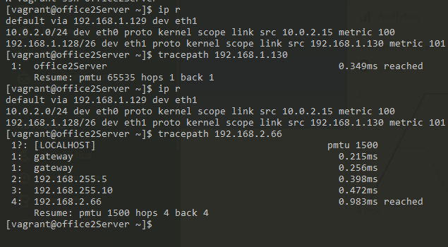
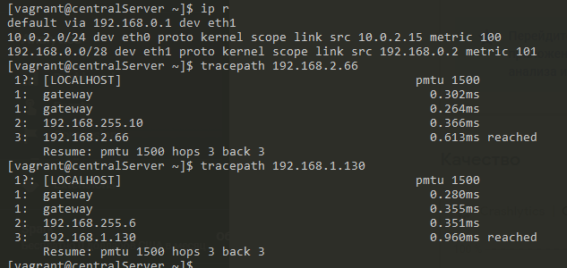
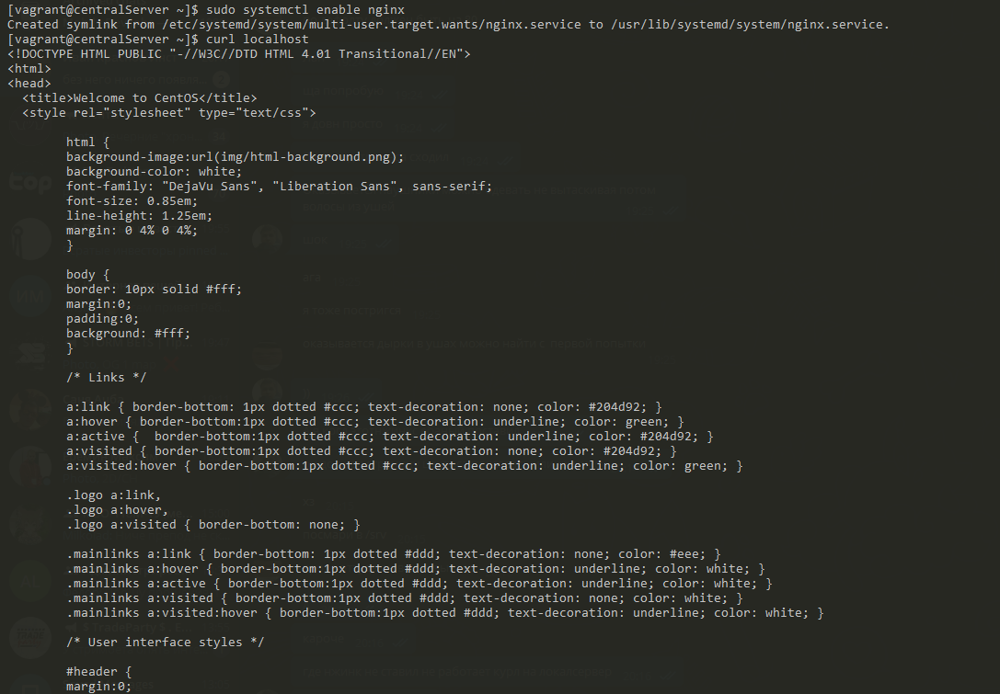
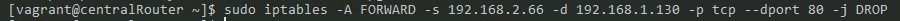
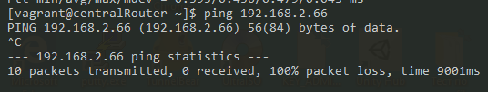

# Лабораторная работа 1
## Задание 1
- разобрать структуру приложенного Vagrantfile
- нарисовать схему
- расписать возможные подсети

---
## Задание 2
- Найти свободные подсети;
- Подсчитать, сколько узлов в каждой подсети, включая свободные;
- Указать broadcast-адрес для каждой подсети;
- Проверить, нет ли ошибок при разбиении.

### Первая сеть
Подсети:

#### 192.168.2.0/26
Узлов: 62
Broadcast: 192.168.2.63

#### 192.168.2.64/26
Узлов: 62
Broadcast: 192.168.2.127

#### 192.168.2.128/26
Узлов: 62
Broadcast: 192.168.2.191

### Вторая сеть
Подсети:

#### 192.168.1.0/25
Узлов: 126
Broadcast: 192.168.1.127

#### 192.168.1.128/26
Узлов: 62
Broadcast: 192.168.1.191

#### 192.168.1.192/26
Узлов: 62
Broadcast: 192.168.1.255

### Третья сеть
Подсети:

#### 192.168.0.0/28
Узлов: 14
Broadcast: 192.168.0.15

## Задание 3

- Все серверы и роутеры должны ходить в Интернет черз inetRouter;
- Все серверы должны видеть друг друга;
- У всех новых серверов отключить дефолт на NAT (eth0), который Vagrant поднимает для связи; // уже сделано в VagrantFile заранее, 
- в README приложить скриншоты tracepath и `ip r`

### office1Server

### office2Server

### centralServer

## Задание 4
- поднять nginx на officе2Server
- запретить office1Server ходить на office2Server на 80й порт, все остальные должны работать

### Nginx

###  Блокировка запроса на 80 порт

